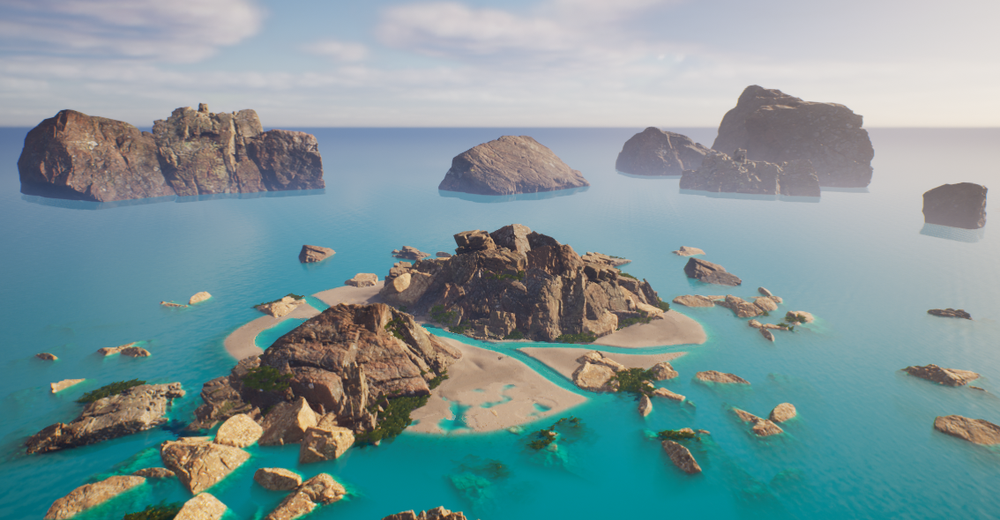

# The Islander

The Islander is a Top Down Shooter type game where the player's goal is to embody a character lost on a wild island and make him survive the attack of monsters.
  

  
## Install the game

To be able to play The Islander you can go through my portfolio at the following address: https://patricksardinha.com/ and under the "Works" section, you can find the project and download the application.
  
## Play the game

Below are listed the commands to use in game:

**[W]** : Move Forward.

**[A]** : Move Left.

**[S]** : Move Backward.

**[D]** : Move Right.

**[Mouse]** : Rotate the character.

**[LeftClick]** : Fire a projectile.

**[RightArrow]** : Rotate the character to the right and auto fire.

**[LeftArrow]** : Rotate the character to the left and auto fire.

**[UpArrow]** : Rotate the character up and auto fire.

**[DownArrow]** : Rotate the character down and auto fire.
  
## Quit the game

**[ALT+F4]** : Quit the game.
  
## Credits

This game was developed on Unreal Engine 5.2.0 and 3D assets, textures/materials and shaders are sourced from Epic Games Marketplace and Quixel Brige.
  
## Author

Patrick Sardinha
